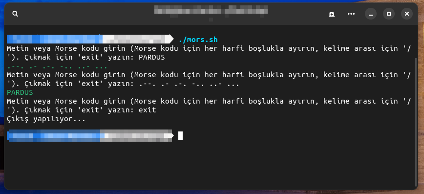

# Morse-Translator
Linux Terminal Script Shell Application for Radio Amateurs Who Can Translate Morse Code to Text and Text to Morse Code

Install Git Clone 

Github Package Must Be Installed On Your Device.
```bash
sudo apt install git  -y
```

----------------------------------

# Installation
Install Morse-Translator

```bash
sudo git clone https://github.com/cektor/Morse-Translator.git
```
```bash
cd Morse-Translator
```
```bash
sudo chmod +x mors.sh
```
```bash
./mors.sh
```

# Screenshot


